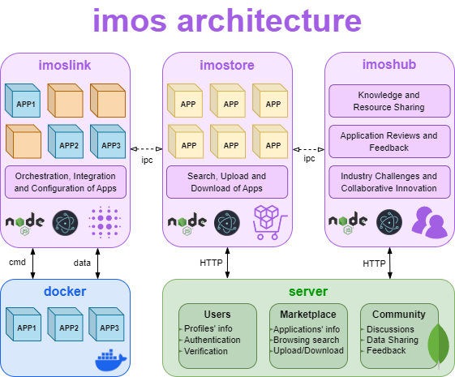

    

 

Welcome to the Industry Modular Operating System repository, built on top of <a href="https://www.docker.com/" target="_blank">Docker</a> and powered by <a href="http://electron.atom.io" target="_blank">Electron</a>. Offering integration and deploymenty tools (IMOSlink), an industry-oriented marketplace (IMOStore) and a collaborative hub (IMOShub). This is a work in a progress a not a final product. <b>To collaborate on this project feel free to contact me, lets buid IMOS together, a platform built by the industry for the industry</b>.

  <a href="#how-to-use">Overview</a> •
  <a href="#how-to-use">Requirements</a> •
  <a href="#how-to-use">How To Use</a> •
  <a href="#platform">Platform</a> •
  <a href="#key-features">Key Features</a>

## Overview
IMOS is a modular platform designed to help small and medium-sized enterprises navigate the shift from I4.0 to I5.0. It enhances software integration, distribution, and collaboration by offering containerized software solutions and emphasizing sustainability and the importance of collaborative networks. IMOS supports the execution of both on-premise and cloud applications. The platform enables seamless interaction and resource-sharing between developers and industrial managers to foster innovation and problem-solving.
## Requirements
## How To Use
## Platform
IMOS, powered by Docker and built with NodeJS and Electron, facilitates software distribution and integration, serving as the central orchestrating component for interconnected containers in a modular system, communicating and launching other applications based on user input.
 
 
Through IMOS and the IMOSlink app, users seamlessly integrate their software applications or acquire solutions from IMOStore within the platform. This integration enables configuration of applications and connection of their execution with intended endpoints. Users can open each application from the home screen and manage their execution with IMOSlink. 
 

  <picture>
    <source media="(prefers-color-scheme: dark)" srcset="utils/images/platform-dark.png">
    <source media="(prefers-color-scheme: light)" srcset="utils/images/platform-light.png">
    
  </picture>

The IMOSlink app serves as a bridge between Docker and the user, orchestrating installed applications and connecting hardware endpoints to software applications. Docker's integration, distribution, and modularity capabilities make it ideal for IMOS, ensuring seamless compatibility and efficient management of containerized applications. 
 
 
IMOStore and IMOShub are the other two modules within the IMOS platform, and perhaps the most important as they aim to support SMEs. IMOStore allows users to explore and acquire applications or submit their own for review and distribution. IMOShub facilitates collaboration, knowledge sharing, and resource exchange among users from different backgrounds and roles.
 
 
(Although the IMOShub module has been conceptualized, it is still under development). 
 
 
Finally, IMOScloud was added to the design and implemented to provide a cloud environment for executing IMOStore published applications. It can be viewed as a Cloud Computing tool for orchestrating and executing several, yet verified applications.
 
 
These modules and in-built apps are hosted on IMOS servers, using Express microservices for managing user information, authentication, marketplace functionalities, and cloud apps execution. Data generated from user profiles, marketplace application distribution, and community interactions are stored in two separate MongoDB clusters.

## Key Features

* **Modularity and Synergy**. Choose from a wide range of containerized applications that adapt well to any environment, promoting adaptability and collaboration.
* **Customization**. Optimize automation systems for effectiveness, security, and productivity by selecting tailored commercial apps and dynamically changing system configurations.
* **Integration and Standardization**. Software applications follow a common format through containerization, making integration with different production systems easier.
* **Collaboration within the Community**. Manufacturing businesses and software stakeholders contribute to the IMOS ecosystem by publishing software, exchanging data, and building integrated solutions.
* **Innovation**. Exposure to a wide range of potential customers encourages software vendors to innovate and address manufacturing concerns. Manufacturing organizations benefit from increased effectiveness and quality of operations and regular software updates.
* **Data Feedback Loop**. Applications can return data to the IMOStore, helping software suppliers refine their solutions based on empirical findings.
* **Monetization**. Software companies can generate income and increase visibility by monetizing their apps and services through the IMOStore. Manufacturing companies save money by paying only for the apps they need or even monetizing collected data from industrial processes.
